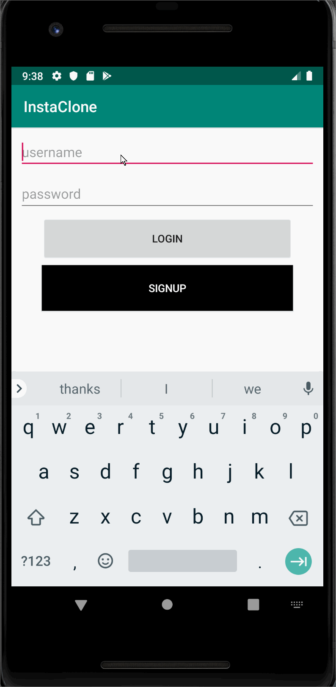
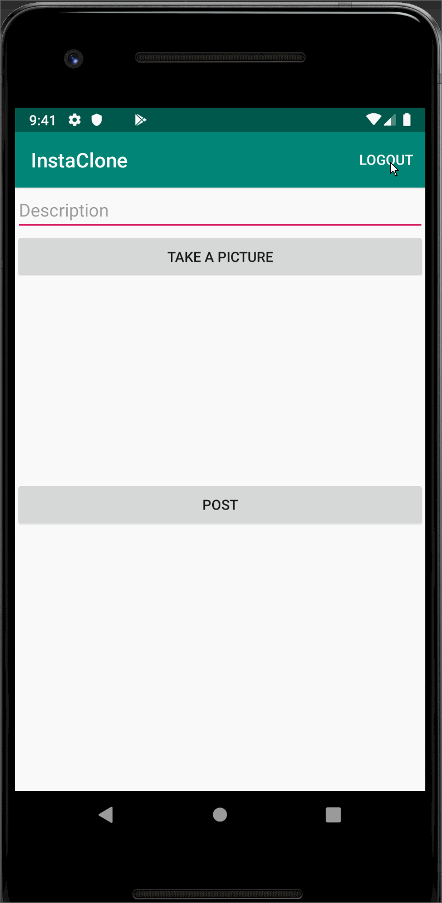

# Project 3 - *InstaClone*

**IntsaClone** is a photo sharing app similar to Instagram but using Parse as its backend.

Time spent: 10 hours spent in total

## User Stories

The following **required** functionality is completed:

- [x] User can sign up to create a new account using Parse authentication.
- [x] User can log in and log out of his or her account.
- [x] The current signed in user is persisted across app restarts.
- [x] User can take a photo, add a caption, and post it to "Instagram".

The following **optional** features are implemented:

- [ ] User sees app icon in home screen and styled bottom navigation view
- [ ] Style the feed to look like the real Instagram feed.
- [ ] After the user submits a new post, show an indeterminate progress bar while the post is being uploaded to Parse.

The following **additional** features are implemented:

- [ ] List anything else that you can get done to improve the app functionality!

## Video Walkthrough

Here's a walkthrough of implemented user stories:

*Login and take picture*

 

*Current user persistence, logout and sign up*

 

GIF created with [LiceCap](http://www.cockos.com/licecap/).

## Notes

Had some challenges with this one, since there were so many components.
- Had trouble setting up parse because of a url error 
- It was somewhat difficult to set up the initial login screen. I made a lot my variables public (even though that's not the best practice) because I kept getting class errors
- Problems with emulator and invalid session tokens...wiping the emulator is a neat trick
This project took more time than I expected.

## Open-source libraries used

- [Android Async HTTP](https://github.com/codepath/CPAsyncHttpClient) - Simple asynchronous HTTP requests with JSON parsing
- [Glide](https://github.com/bumptech/glide) - Image loading and caching library for Android

## License

    Copyright [yyyy] [name of copyright owner]

    Licensed under the Apache License, Version 2.0 (the "License");
    you may not use this file except in compliance with the License.
    You may obtain a copy of the License at

        http://www.apache.org/licenses/LICENSE-2.0

    Unless required by applicable law or agreed to in writing, software
    distributed under the License is distributed on an "AS IS" BASIS,
    WITHOUT WARRANTIES OR CONDITIONS OF ANY KIND, either express or implied.
    See the License for the specific language governing permissions and
    limitations under the License.
